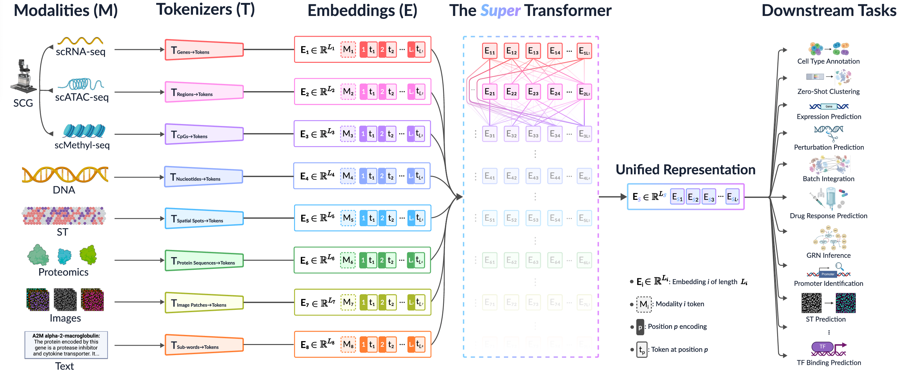

# Multimodal Foundation Transformer Models for Multiscale Genomics




This repository supplements the manuscript **Multimodal Foundation Transformer Models for Multiscale Genomics**. It is designed to introduce the application of Transformer models in the analysis of single-cell genomics data, particularly for cell type annotation.

## Background
Transformers, originally developed for tasks in natural language processing (NLP), have shown remarkable adaptability and success in analyzing complex patterns in high-dimensional biological datasets, such as single-cell RNA sequencing (scRNA-seq). By leveraging Transformers, researchers can effectively manage the sequential and intricate nature of biological data, which is pivotal for capturing essential dependencies and patterns crucial for precise cell type annotation.

## Learning Objectives
This primer provides:
- A comprehensive introduction to using Transformer models in single-cell genomics.
- Insights into how Transformers handle the complex data structure of scRNA-seq.
- Guidance on applying these models to annotate cell types accurately.

## Prerequisites
Readers should have a basic understanding of:
- Single-cell technology principles.
- Python programming.
- Functionality of [Scanpy](https://scanpy.readthedocs.io/en/stable/) and [Anndata](https://anndata.readthedocs.io/en/latest/) packages.

## Installation Guide

Before diving into the  tutorial, ensure that the necessary packages are installed. We will need `Scanpy` for single-cell analysis and `Transformers` from Hugging Face for our Transformer models. Use the following commands to install these packages:

- To install **Scanpy**, use this command in a notebook cell:
  ```python
  !pip install scanpy

- To install **Transformers**, use this command in a notebook cell:
  ```python
  !pip install transformers


## Data
All necessary data files and detailed instructions are provided within the notebook to ensure you can easily follow along and apply the concepts demonstrated in the tutorial.

## Tutorial
For a practical application of these concepts, refer to the tutorial available as:
- [A Primer on Transformers in Single-Cell Genomics](https://colab.research.google.com/drive/14tMvT82icSNRZZKN-Z2BKGIRH5-RCMpK#scrollTo=BBhBkJffYg_b)

## System Requirements

This tutorial and the associated tools are designed to be platform-independent and can be run on a variety of systems. Below are the specifics regarding system compatibility:

- **Google Colab**: For a hassle-free setup and no local system requirements, you can run the notebook directly in [Google Colab](https://colab.research.google.com/github/sumeer1/A-Primer-on-Transformers-in-Single-Cell-Genomics/blob/main/A%20Primer%20on%20Transformers%20for%20Cell%20Type%20Annotation.ipynb). This platform automatically handles all dependencies and provides a robust environment with GPU support.

- **Local Environments**:
  - **Linux**: Tested on macOS Sonoma (14.5). Ensure you have Python installed, along with pip for package management.
  - **macOS**: Tested on Ubuntu 20.04 with similar requirements as Linux.
 
    

Feel free to explore the notebook, experiment with the code, and dive deeper into the application of Transformers in genomics!
